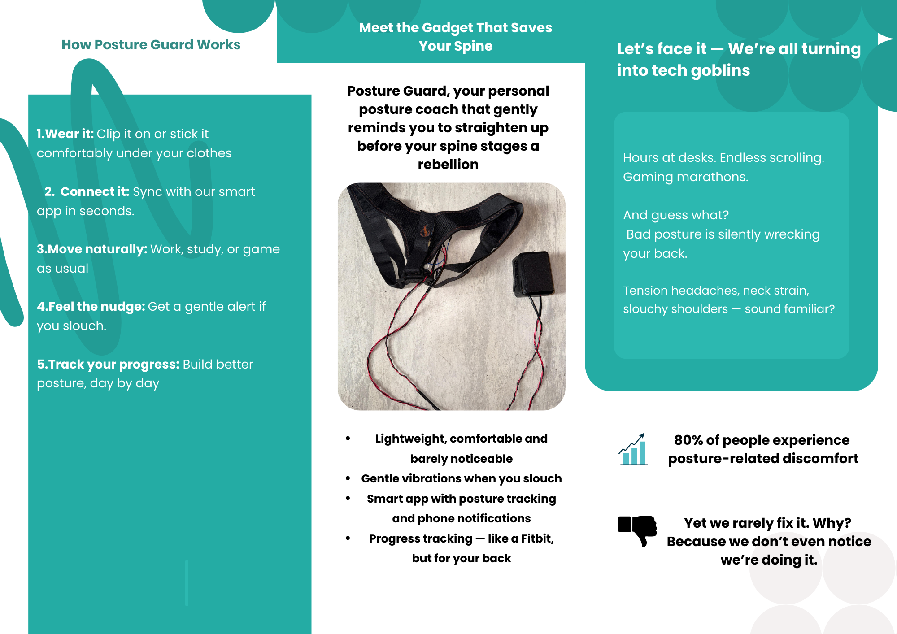

# Posture-Guard 🎯

**Posture-Guard** is a smart, wearable posture monitoring system designed to promote musculoskeletal health by encouraging better sitting habits during prolonged screen time 🖥️🪑.

The device continuously tracks your sitting posture in real-time and provides immediate haptic feedback ✋ and app-based alerts 📲 whenever slouching is detected. This helps you maintain healthier posture and reduce the risk of back and neck pain 💪🦴.

Paired with our custom-built **PostureGuard mobile app**, users can visualize posture trends 📈, receive personalized exercise recommendations 🏋️‍♂️, and monitor daily progress — all through a clean and intuitive interface 🧑‍💻.

